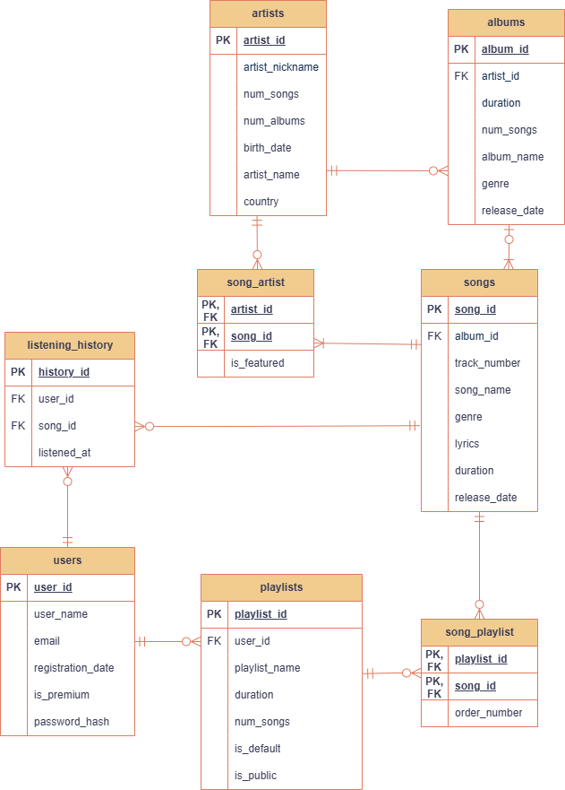

# Music Streaming Service Database

Проект базы данных музыкального онлайн-сервиса, вдохновлённого современными стриминговыми платформами.

Проект охватывает полный цикл проектирования базы данных: от анализа предметной области и построения концептуальной модели до реализации в PostgreSQL, генерации тестовых данных и разработки аналитических запросов.

## О проекте

База данных предназначена для хранения и обработки информации о музыкальном каталоге и активности пользователей.

Система поддерживает:

* управление исполнителями, альбомами и треками;
* регистрацию пользователей;
* создание плейлистов;
* хранение истории прослушиваний;
* выполнение аналитических запросов;
* формирование рекомендаций.

В рамках проекта были выполнены:

* анализ предметной области;
* построение ER-модели;
* нормализация данных;
* преобразование ER-модели в реляционную;
* реализация схемы в PostgreSQL;
* разработка ограничений целостности;
* реализация бизнес-логики с использованием триггеров;
* генерация тестовых данных;
* оптимизация сложных SQL-запросов.

## Предметная область

База данных хранит информацию о следующих сущностях:

* исполнители;
* альбомы;
* треки;
* пользователи;
* плейлисты;
* история прослушиваний.

## Проектирование базы данных

### Реляционная схема



## Документация

| Документ                 | Описание                          |
| ------------------------ | --------------------------------- |
| docs/relational-model.md | Реляционная модель базы данных    |
| docs/queries.md          | Аналитические SQL-запросы         |

## Основные возможности

### Музыкальный каталог

Система позволяет хранить информацию о:

* исполнителях;
* музыкальных альбомах;
* треках;
* совместных композициях и коллаборациях.

### Пользователи и плейлисты

Пользователи могут:

* создавать собственные плейлисты;
* добавлять треки в плейлисты;
* использовать системный плейлист «Избранное»;
* прослушивать музыкальные композиции.

### Аналитика прослушиваний

Каждый факт прослушивания сохраняется в базе данных и может использоваться для:

* анализа популярности треков;
* формирования рекомендаций;
* анализа поведения пользователей;
* построения музыкальных рейтингов;
* исследования жанровых предпочтений аудитории.

### Бизнес-логика

Часть бизнес-логики реализована на уровне СУБД с использованием триггеров и функций.

Автоматически поддерживаются:

* количество треков и длительность альбомов;
* количество альбомов и треков исполнителей;
* статистика плейлистов;
* создание плейлиста «Избранное» при регистрации пользователя.

## Реализация

База данных реализована в PostgreSQL.

В проекте используются:

* первичные ключи (PRIMARY KEY);
* внешние ключи (FOREIGN KEY);
* ограничения уникальности (UNIQUE);
* проверочные ограничения (CHECK);
* триггеры;
* хранимые функции.

## Тестовые данные

Для моделирования работы музыкального сервиса была выполнена генерация тестовых данных на языке Python.

В качестве основы использовался набор данных популярных композиций Spotify.

Сгенерированы:

* исполнители;
* альбомы;
* треки;
* пользователи;
* плейлисты;
* история прослушиваний.

История прослушиваний содержит более 1 000 000 записей, что позволяет исследовать производительность аналитических запросов на объёмах данных, приближенных к реальным.

## Примеры аналитических запросов

В рамках проекта были реализованы запросы для решения практических задач музыкального сервиса:

* определение топ-5 треков по каждому жанру за последние 30 дней;
* персонализированные рекомендации пользователям;
* анализ популярности исполнителей;
* исследование пользовательской активности;
* анализ музыкальных предпочтений различных групп пользователей.

Подробное описание запросов приведено в файле `docs/queries.md`.

## Используемые технологии

* PostgreSQL
* SQL
* Python
* pgAdmin

## Структура репозитория

```text
music-streaming-db/
│
├── README.md
│
├── docs/
│   ├── relational-model.md
│   └── queries.md
│
├── diagrams/
│   └── relational-diagram.png
│
├── sql/
│   ├── schema.sql
│   ├── constraints.sql
│   ├── triggers.sql
│   ├── indexes.sql
│   └── queries
│
└── data-generation/
    └── generate_data.py
```

