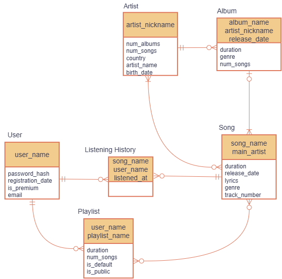

# Music Streaming Service Database

Учебный проект по проектированию базы данных музыкального стримингового сервиса.

Проект демонстрирует процесс проектирования базы данных:
- построение ER-модели
- анализ нормальных форм
- преобразование в реляционную модель
- реализация схемы в SQL

## Предметная область

База данных предназначена для хранения информации о:

- пользователях
- артистах
- альбомах
- песнях
- плейлистах
- истории прослушивания

## ER-диаграмма

Подробное описание модели:
- [ER Model](docs/er-model.md)
- [Normalization](docs/normalization.md)
- [Relational Model](docs/relational-model.md)

## SQL реализация

SQL код находится в папке `sql`:

- `schema.sql` — создание таблиц
- `constraints.sql` — ключи и ограничения
- `queries.sql` — примеры запросов
